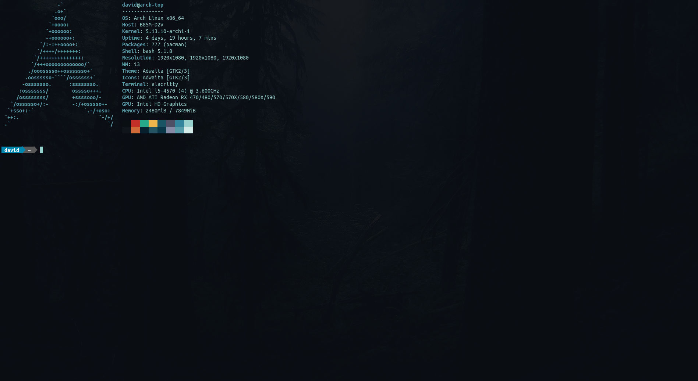

# My-Alacritty-Config
My Alacritty configuration file, originally based off of Derek Taylor's (DistroTube's) Alacritty configuration with color modifications. Requires installation of ttf-ubuntu-font-family.

